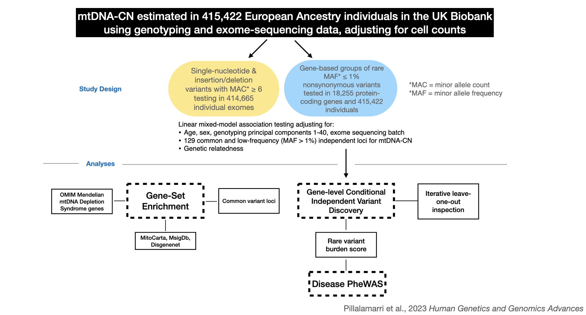

# mtDNA-CN-ExWAS

Rare variant association testing to mitochondrial copy number in UK Biobank

**Author:** Vamsee Pillalamarri

This repo contains code (pipeline, scripts, and analysis notebooks) relating to Pillalamarri et al. 2023 HGG Advances "Whole-exome sequencing in 415,422 individuals identifies rare variants associated with mitochondrial DNA copy number" (PMID 36311265, doi: 10.1016/j.xhgg.2022.100147).

This repository is a **snapshot of a private repository** (`ArkingLab/mito_rare-variant`) with more comprehensive access to a variety of resources for the project along with results from the single- and rare-variant burden testing. Please reach out to `vpillal1@alumni.jh.edu` or `darking@jhmi.edu` for raw BOLT-LMM results from single- and GENESIS aggregate rare-variant burden testing results.

## Study Design



## R Package Requirements

Install BIOCONDUCTOR Install Manager:

```R
if (!require("BiocManager", quietly = TRUE))
    install.packages("BiocManager")
```

### Aggregate Association Testing
- [GENESIS](https://bioconductor.org/packages/release/bioc/html/GENESIS.html)
- [SeqArray](https://bioconductor.org/packages/release/bioc/html/SeqArray.html)

Install Bioconductor packages:
```R
BiocManager::install("SeqArray")
BiocManager::install("GENESIS")
```

## Scripts

1. **Aggregate Association Testing using GENESIS:**
   Example call:
   ```
   Rscript src/scripts/aggregate_association_testing.R 1 --AF.max 0.01 --test SMMAT --qv nonsyn.impact_mod_high --ncores 4
   ```

2. **Leave one out testing:**
   Example call:
   ```
   Rscript src/scripts/optimized_loo_script.R --gene GENE_NAME --chr CHROMOSOME --af_max 0.01 --output results.rds --plot --plot_type SMMAT --save_dir ./plots --cores 4
   ```

3. **Power analysis:**
   - `src/scripts/power-analysis.R`
   - `src/scripts/power-analysis.py` (Rewritten in Python)

4. **Gene-level conditional variant breakdown functions:**
   - `conditional_variants.breakdown.R`

5. **Single-variant testing using BOLT-LMM:**
  - `src/scripts/pipeline_shell_scripts/run.bolt_lmm_adjusted_forGWASsnps.sh`
  ```
  Run as:
  # On UKB RAP CLI:
  #  <log into UKB RAP using `dx login`>
  #       qrsh -now y -pe local 16 -l h_vmem=5G,mem_free=5G,h_fsize=10G
  # OPTIONAL:
  #       cd /dcs01/arking/arkinglab/software/src/BOLT-LMM/
  #       module load singularity/3.2
  #       module load python/
  #       singularity shell -B /tmp,/dcl01,/dcs01 singularity-bolt-lmm.simg
  ```

## Analysis Notebooks

1. **Table 1A:** `src/analysis_notebooks/Table_1A.Rmd`
2. **Table 1B** `src/analysis_notebooks/Table_1B.Rmd`
3. **PheWAS Analyses** `src/analysis_notebooks/phewas-analyses.Rmd`
4. **PheWAS Additional Analyses** `src/analysis_notebooks/phewas-additional-analyses.Rmd`

## Data Locations

- pVCFs: `/dcl01/arking/data/static/UKBiobank/WES/pVCF`
- plink: `/dcl01/arking/data/static/UKBiobank/WES/plink`

**NOTE:** pVCFs combine multiallelic sites into one record, while plink splits them; the plink *.bim* file reflects this difference

### Gene Lists

Gene lists can be found in the "resources" folder in this repo, or on JHPCE at `/dcl01/arking/data/static/UKBiobank/gene_lists`.

- `gwas_genes.txt`: Genes identified from GWAS for mtDNA-CN
- `depletion_genes.txt`: 15 genes known to be causal for mtDNA depletion syndromes

### Mitocarta Gene Pathways

Mitocarta gene pathways: `/dcs01/arking/arkinglab/resources/mitoCarta/Human.MitoPathways3.0.gmx`
